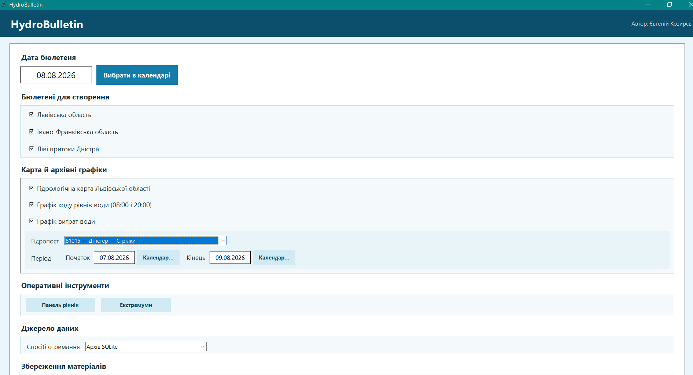
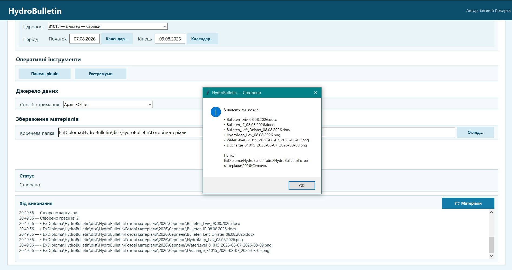
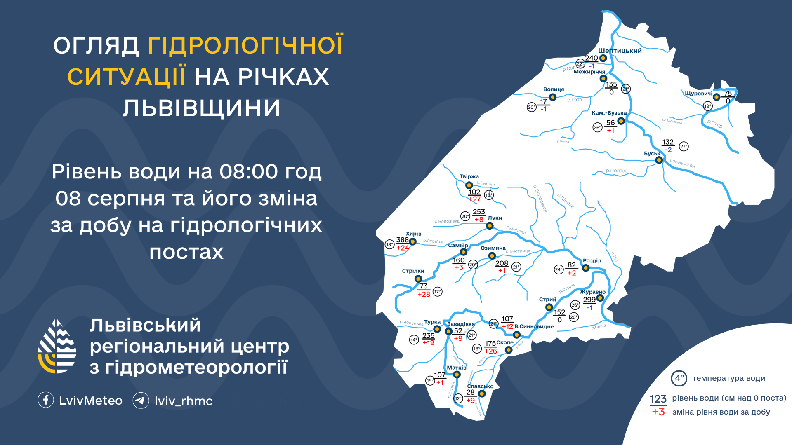
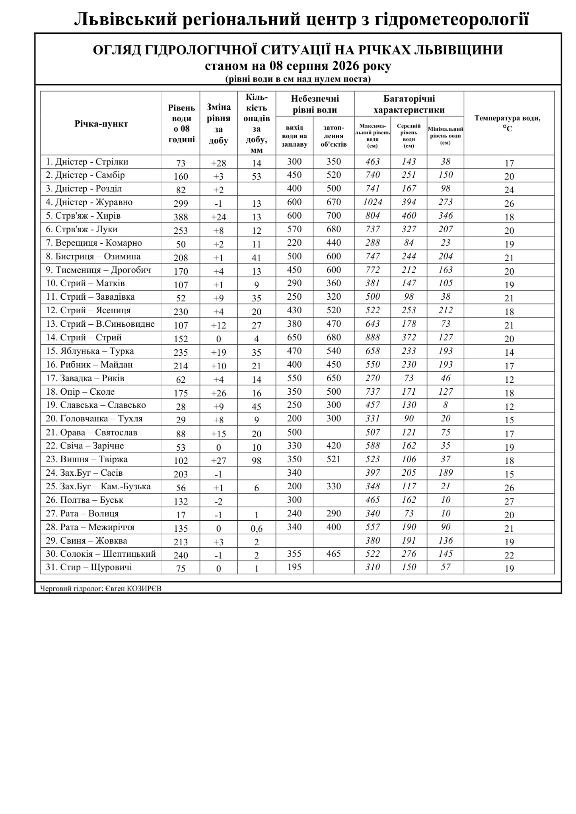
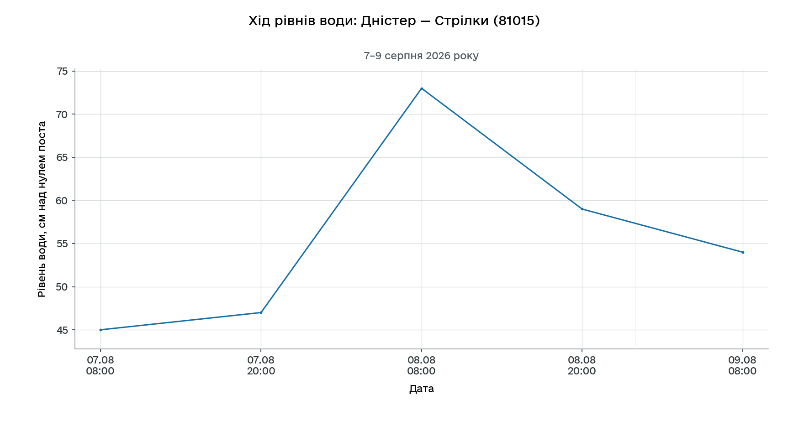
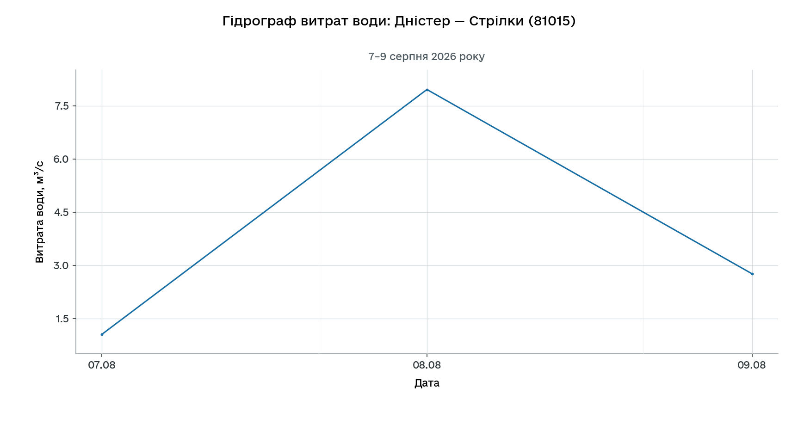
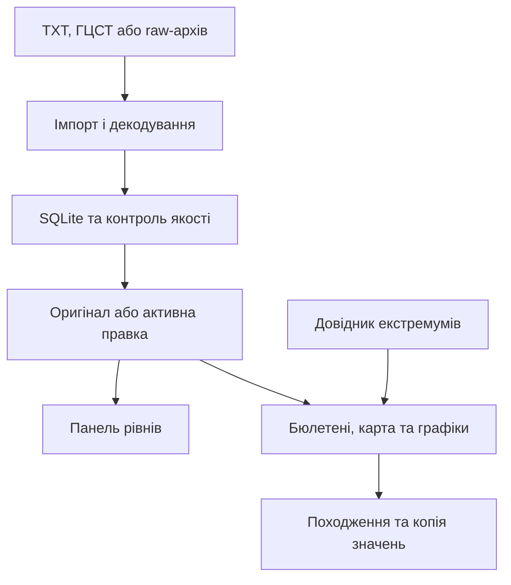
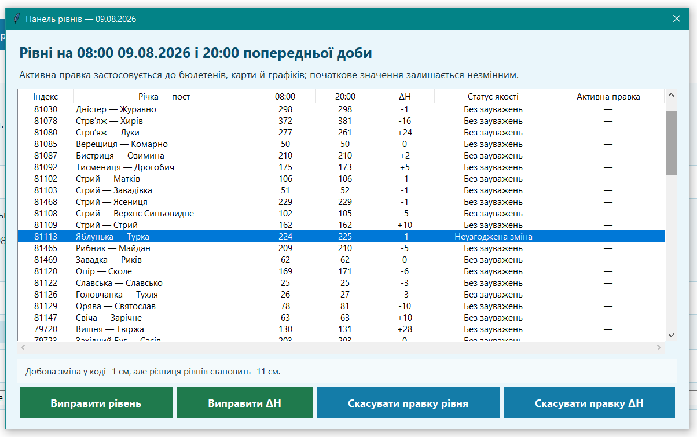
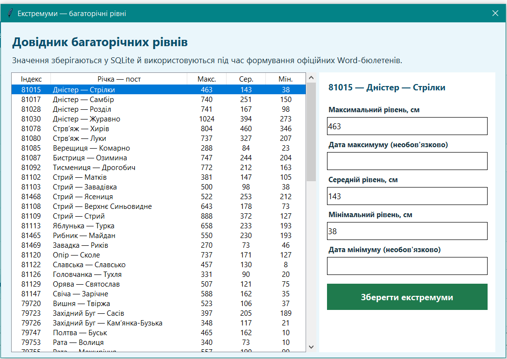

# HydroBulletin

**Обробка кодованих повідомлень, контроль якості та формування гідрологічних матеріалів.**

HydroBulletin працює з кодованими гідрологічними та метеорологічними повідомленнями. Отримані дані зберігаються в локальному архіві й SQLite, після чого їх можна перевірити та використати для створення бюлетенів, карти і графіків. Програма розрахована на щоденну роботу гідролога. Якщо онлайн-джерело тимчасово недоступне, частину роботи можна продовжити з уже збереженими даними.

| Охоплення                                   | Вихідні матеріали                             | Перевірка                                  |
| ---------------------------------------------------- | ------------------------------------------------------------- | --------------------------------------------------- |
| 71 гідропост і 10 метеостанцій | 3 DOCX-бюлетені, карта та 2 графіки PNG | 139/139 автоматизованих тестів |



*Головне вікно у Windows. Основна дата матеріалів — 08.08.2026; період архівних графіків — 07–09.08.2026.*

Скриншоти та приклади графіків зроблено в попередній збірці. Відтоді інтерфейс трохи змінився: поля вибору й дат стали компактнішими. Для витрат тепер автоматично підбирається масштаб, а лінія рівнів закінчується на останньому наявному спостереженні.

## Зміст

- [Можливості](#features)
- [Встановлення та перший запуск](#quick-start)
- [Джерела даних і командний рядок](#data-sources)
- [Приклади матеріалів](#examples)
- [Архів, походження даних і контроль якості](#data-quality)
- [Результати перевірки](#validation)
- [Вимірювання часу](#performance)
- [Windows-пакет](#windows-package)
- [Структура й технології](#structure)
- [Межі застосування та автор](#scope)

<a id="features"></a>

## Можливості

| Напрям                        | Що реалізовано                                                                                                                                                                    |
| ----------------------------------- | ---------------------------------------------------------------------------------------------------------------------------------------------------------------------------------------------- |
| Отримання даних       | Локальний TXT, папка повідомлень, основний сервер ГЦСТ, дзеркало, raw-архів і наявна SQLite                                     |
| Декодування              | ЗРУР52, ЗРУР53, ЗРУР71; рівні, зміни, температура, витрата, опади й підтримувані льодові групи КС-15; SYNOP-опади |
| Бюлетені                    | Львівська область, Івано-Франківська область та ліві притоки Дністра; заповнення трьох Word-шаблонів         |
| Карта                          | Ранковий рівень, добова зміна й температура води на 21 позиції шаблону Львівської області                            |
| Графіки                      | Один хронологічний ряд рівнів о 08:00 і 20:00 та окремий гідрограф витрат за вибраний період                               |
| Контроль якості       | Перевірка діапазонів, пропусків і узгодженості добової зміни; українські назви статусів                            |
| Ручні правки             | Зміна рівня або добової зміни з автором і причиною; скасування зі збереженням історії                                  |
| Довідкові рівні       | Редактор багаторічного максимуму, середнього й мінімуму для бюлетенів                                                             |
| Відтворюваність      | Незмінні raw-файли, SHA-256, захист від дублікатів і зв'язки готових матеріалів із використаними значеннями   |
| Робота користувача | Графічний інтерфейс, журнал виконання, командний рядок і Windows-пакет                                                                    |

<a id="quick-start"></a>

## Встановлення та перший запуск

### З вихідного коду

Для запуску потрібен **Python 3.10 або новіший**, Tkinter і залежності з [requirements.txt](requirements.txt). Основна перевірка програми проводилася у Windows 10. Під час фінальних вимірювань використовувався Python 3.12.8, 64-bit.

Завантажте репозиторій і відкрийте PowerShell у папці, де розташований `main.py`:

```powershell
python --version
python -m venv .venv
.\.venv\Scripts\Activate.ps1
python -m pip install -r requirements.txt
python main.py --gui
```

Якщо PowerShell не дозволяє активацію середовища, можна викликати його Python без активації:

```powershell
.\.venv\Scripts\python.exe -m pip install -r requirements.txt
.\.venv\Scripts\python.exe main.py --gui
```

Після налаштування середовища програму можна запускати через `run_gui.bat`. У цьому файлі використовується команда `python`. Якщо на комп'ютері встановлено кілька версій Python, варто перевірити, на яку з них вона вказує.

Для самого створення DOCX Microsoft Word не потрібен — файли формуються через `python-docx`. Word або інший сумісний редактор знадобиться вже для перегляду чи друку готового документа.

### Перша перевірка без онлайн-доступу

Після встановлення залежностей запустіть синтетичний регресійний сценарій:

```powershell
python scripts/validate_regression.py --samples 3
```

Сценарій бере три файли з `demo_data/regression/` за **11–12.07.2026**. Для цього запуску створюється окрема база, а з даних формуються три бюлетені, карта і два графіки. Потім той самий набір проходить повторну перевірку: контролюються SQLite, походження значень і робота з raw-архівом та базою без мережі. Наприкінці в консолі з'являються шлях до JSON-звіту та папка з результатами.

Папку для результатів можна задати через `--work-dir validation_results/public_demo`. Сценарій очікує новий каталог, тому для наступного запуску потрібно вказати іншу назву.

> У репозиторії є два набори даних: синтетичний за 11–12.07.2026 у `demo_data/regression/` та експлуатаційний за 07–09.08.2026 у `demo_data/operational/`. Скриншоти показують серпневий приклад. Для його відтворення потрібно запускати експлуатаційний сценарій; звичайний регресійний запуск використовує липневі дані.

<a id="data-sources"></a>

## Джерела даних і командний рядок

У GUI джерело вибирається зі списку: «Автоматично», «Локальний TXT-файл», «Папка TXT-файлів» або «Архів SQLite». Для роботи через мережу окремо задається основний ГЦСТ, дзеркало чи автоматичний режим. В останньому випадку програма сама переходить до резервного сервера, якщо основний не відповідає.

Коли список закритий, коліщатко миші прокручує форму і не змінює вибраний пост, джерело чи сервер. Щоб змінити значення, список потрібно спочатку відкрити. Поля початку й кінця періоду стоять біля календарів, а у вузькому вікні автоматично переходять у два рядки.

| Параметр CLI          | Призначення                                                                                                              |
| ----------------------------- | ----------------------------------------------------------------------------------------------------------------------------------- |
| `--source local --file ...` | Імпорт одного гідрологічного TXT; окремий SYNOP можна додати через`--meteo-file` |
| `--batch-folder ...`        | Хронологічний імпорт папки датованих ZRUR/SYNOP-файлів                                       |
| `--source online`           | Завантаження з ГЦСТ із налаштованими обліковими даними                              |
| `--source archive`          | Повторна обробка збережених raw-повідомлень                                                     |
| `--source database`         | Створення матеріалів із наявної SQLite без нового імпорту                               |
| `--source auto`             | Вибір серед доступних джерел із можливістю використання raw-архіву           |

Для імпорту папки використовується саме `--batch-folder`; варіанта `--source batch` у CLI немає. Програма розпізнає дві схеми назв: `ДД.ММ.РРРР_ТИП.txt` і `РРРР-ММ-ДД_ТИП.txt`. Замість `ТИП` очікується `ZRUR52`, `ZRUR53`, `ZRUR71` або `SYNOP`.

Приклад імпорту відкритого набору в робочий архів і формування матеріалів:

```powershell
python main.py --batch-folder demo_data/regression --date 12.07.2026 --map --level-chart --discharge-chart --chart-station 79726 --start-date 11.07.2026 --end-date 12.07.2026
```

Після імпорту можна повторно сформувати бюлетені й карту без читання вхідних TXT:

```powershell
python main.py --source database --date 12.07.2026 --map
```

Повний перелік параметрів:

```powershell
python main.py --help
```

### Онлайн-доступ

Якщо `.env` ще немає, створіть його з безпечного зразка:

```powershell
if (!(Test-Path .env)) { Copy-Item .env.example .env }
```

У `HYDRO_SOURCE_USERNAME` і `HYDRO_SOURCE_PASSWORD` потрібно записати надані облікові дані. У тому самому `.env` можна змінити час очікування, кількість спроб і паузу між ними. Адреси серверів уже є в програмі. Якщо їх потрібно замінити, для цього передбачені `HYDRO_SOURCE_PRIMARY_URL` і `HYDRO_SOURCE_MIRROR_URL`.

Для `--gcst-source` доступні `primary`, `mirror` і `auto`. Режим `auto` спочатку звертається до основного сервера. Якщо запит не вдається, наступна спроба йде до дзеркала. Отримати онлайн-дані можна лише тоді, коли сервер доступний і обліковий запис має потрібні права.

**Не додавайте `.env`, приватні оперативні TXT та робочі бази до Git.** Для офлайн-перевірки облікові дані не потрібні.

<a id="examples"></a>

## Приклади матеріалів

Більшість прикладів нижче показані за **08.08.2026**. Графіки охоплюють **07–09.08.2026**, оскільки для них потрібен ряд за кілька діб. Неузгоджена зміна в панелі рівнів показана вже для **09.08.2026**.

<details>
<summary>Успішне формування шести матеріалів у Windows</summary>



*За один запуск створено три DOCX, карту й два графіки. Журнал показує хід виконання та розташування готових файлів.*

</details>

### Гідрологічна карта



*Карта за 08.08.2026 на шаблоні 1920 × 1080. Біля постів показано рівень у сантиметрах над нулем поста, зміну за добу й температуру води. Це карта спостережень, а не прогноз затоплення.*

### Word-бюлетень

<details>
<summary>Бюлетень Львівської області за 08.08.2026</summary>



*Таблиця зберігає структуру службового шаблону. Аналогічно формуються окремі бюлетені для Івано-Франківської області та лівих приток Дністра.*

</details>

### Рівні та витрати води

Пост **81015 — Дністер — Стрілки**, період **07–09.08.2026**.



*Ранкові рівні: 45 → 73 → 54 см. Ранкові й вечірні спостереження утворюють одну хронологічну лінію. Значення за 09.08 о 20:00 відсутнє й не замінюється нулем.*

<details>
<summary>Гідрограф витрат за той самий період</summary>



*Три добові значення витрати: 1,05 → 7,96 → 2,76 м³/с.*

</details>

У поточній версії масштаб витрат визначається діапазоном наявних значень
із відступами, без обов'язкового початку осі від нуля. Справжній нуль
залишається видимим. Для рівнів відсутній останній термін 20:00 не займає
місце на осі часу; наявні вечірні точки й внутрішні пропуски зберігаються.
Кількість пропусків у SQLite, як і раніше, враховує весь вибраний період.

### Де зберігаються результати

Готові файли розкладаються за роком і місяцем, наприклад `Готові матеріали/2026/Серпень/`. Для графіка береться місяць його кінцевої дати.

| Матеріал                                     | Приклад назви                      |
| ---------------------------------------------------- | ---------------------------------------------- |
| Львівський бюлетень                | `Bulleten_Lviv_08.08.2026.docx`              |
| Івано-Франківський бюлетень | `Bulleten_IF_08.08.2026.docx`                |
| Ліві притоки Дністра               | `Bulleten_Left_Dnister_08.08.2026.docx`      |
| Карта                                           | `HydroMap_Lviv_08.08.2026.png`               |
| Рівні                                           | `WaterLevel_81015_2026-08-07_2026-08-09.png` |
| Витрати                                       | `Discharge_81015_2026-08-07_2026-08-09.png`  |

<a id="data-quality"></a>

## Архів, походження даних і контроль якості

### Як проходять дані



GUI і командний рядок запускають той самий процес обробки даних. Окремий опис модулів і структури SQLite v4 є в [архітектурі проєкту](docs/ARCHITECTURE.md).

У **raw-архіві** залишаються початкові повідомлення без перезаписування їхнього вмісту. Під час імпорту програма запам'ятовує джерело, дату, файл і SHA-256. Якщо ті самі дані завантажити ще раз, другого імпорту та копій спостережень не з'явиться.

Для готового DOCX або PNG можна простежити, які спостереження потрапили до нього. Через них видно відповідний імпорт і raw-файл із початковим кодом. Такий зв'язок у проєкті позначається як **provenance, або походження даних**. Для кожного використаного значення зберігається його знімок, а після ручного виправлення — також ідентифікатор правки. Якщо цю правку пізніше скасувати, старий знімок готового матеріалу не зміниться. Повторне формування того самого матеріалу вже оновить його запис і зв'язки.

### Статуси QC

QC (*quality control*) виконується одразу після обробки даних. Програма може позначити пропуск, підозріле значення або іншу знайдену проблему, але сама нічого не виправляє. Остаточне рішення щодо такого спостереження залишається за гідрологом.

| Код у SQLite        | Назва в інтерфейсі  | Значення                                                                                                     |
| ----------------------- | ----------------------------------- | -------------------------------------------------------------------------------------------------------------------- |
| `VALID`               | Без зауважень           | Значення пройшло реалізовані початкові правила                             |
| `MISSING`             | Дані відсутні           | Немає значення або потрібного поля                                                     |
| `NOT_CHECKED`         | Не перевірено           | Немає попереднього рівня для зіставлення добової зміни               |
| `SUSPICIOUS`          | Підозріле значення | Перевищено контрольний поріг; потрібна увага гідролога               |
| `OUT_OF_RANGE`        | Поза діапазоном       | Значення поза заданим допустимим інтервалом                                   |
| `INCONSISTENT_CHANGE` | Неузгоджена зміна   | Кодована добова зміна не збігається з різницею ранкових рівнів |
| `CORRECTED`           | Виправлено                | Для цього спостереження використовується активна ручна правка |

Мінус перед рівнем або добовою зміною сам по собі не означає помилку. Пропущене значення на графіку також не перетворюється на нуль. Якщо пропуск є всередині ряду, між сусідніми точками показується пунктир; якщо даних немає в кінці, лінія там просто закінчується. Для точок із зауваженнями QC використовуються окремі позначення.

### Панель рівнів і контрольовані правки



На посту **81113 — Яблунька — Турка** в коді передано добову зміну **−1 см**. Водночас ранковий рівень змінився з **235 см** 08.08 до **224 см** 09.08, тобто фактична різниця становить **−11 см**. Програма бачить цю невідповідність і показує статус «Неузгоджена зміна» разом із поясненням.

У колонці **20:00** показується вечірній рівень попередньої доби; для цього рядка це 225 см. Для контролю добової зміни він не використовується. QC порівнює ранкові строки **08:00 з 08:00** за сусідні дні.

Рівень або добову зміну можна виправити без видалення початкового вимірювання. Для правки вказуються автор і причина, а нове активне значення потім бачать панель, бюлетені, карта та графік. Якщо правку скасувати, запис про це залишиться в історії. При цьому весь рядок не обов'язково стане `VALID`: інший параметр у ньому може бути відсутнім або мати власне зауваження.

### Багаторічні рівні

<details>
<summary>Редактор «Екстремуми»</summary>



Під час першого заповнення багаторічні характеристики переносяться з Word-шаблонів у SQLite. Далі бюлетені беруть їх уже з бази, тому ручні зміни в редакторі не залежать від початкового шаблону. Для числових полів перевіряється порядок «максимум ≥ середнє ≥ мінімум». Дати максимуму й мінімуму можна не заповнювати. Сам редактор працює як довідник і не розраховує екстремуми за період, вибраний для графіка.

</details>

### Опади: відсутність, сліди й округлення

| Вхідний стан або значення                          | Подання в Word-бюлетені                                         |
| ------------------------------------------------------------------------ | ------------------------------------------------------------------------------- |
| Опадів не було,`NO_RAIN`                                   | Порожня комірка                                                   |
| Сліди опадів,`TRACE`                                        | `0,0`                                                                         |
| Виміряна сума менша за 1 мм, наприклад 0,6 | `0,6`                                                                         |
| 35,3 мм                                                                | `35`                                                                          |
| 35,5 або 35,7 мм                                                    | `36`                                                                          |
| Даних немає або сума неповна                     | Порожня комірка без підміни пропуску нулем |

Порожня комірка в бюлетені може з'явитися з різних причин, тому її не можна автоматично читати як «опадів не було». У збережених даних відсутнє спостереження відрізняється від нульової суми. Звичайний числовий нуль також не перетворюється програмою на «сліди».

Для SYNOP програма читає групу `6RRRtR`, індикатор `iR` і перевіряє, чи повністю закритий інтервал **09:00–09:00**. Якщо потрібних строків не вистачає, добова сума не рахується. У гідрологічному коді період інший — **08:00–08:00**. Коли для пов'язаної метеостанції є придатна добова сума, саме вона потрапляє до бюлетеня. Пари гідропостів і метеостанцій записані в `config/precipitation_mapping.json`.

<a id="validation"></a>

## Результати перевірки

Перевірка проводилася в кількох режимах. Автоматизовані тести, синтетичний регресійний набір та експлуатаційний запуск нижче показані окремо. Це різні перевірки, тому їхні кількості між собою не підсумовуються.

### Автоматизовані тести

**Поточний результат — 139/139 тестів пройдено.** Серед них є перевірки декодування, джерел, архіву, міграцій SQLite, SYNOP і QC. Окремо тестуються правки, екстремуми, Word-бюлетені, карта, графіки, спільний робочий процес, GUI та файли запуску. До набору також входять випадки з межами графіків, нульовими значеннями, прокручуванням списків і перенесенням полів дат.

```powershell
python run_tests.py
python run_tests.py --verbose
```

Додатково доступна статична перевірка типів:

```powershell
python -m pip install -r requirements-dev.txt
python -m pyright
```

Частину поведінки GUI все одно потрібно дивитися безпосередньо у Windows — автоматичні тести не показують, як виглядає готове вікно. Окремо перевіряється і вхід до онлайн-джерела з робочими обліковими даними.

### Синтетичний регресійний набір: 11–12.07.2026

| Перевірка                                                                |                                      Результат |
| --------------------------------------------------------------------------------- | ------------------------------------------------------: |
| Вхідні TXT                                                                  |                                                       3 |
| Нормалізовані спостереження                             |                                                     150 |
| Сформовані матеріали                                           |                          6/6: три DOCX і три PNG |
| Імпорти після першого та повторного запуску |                                                   3 / 3 |
| Повні зв'язки походження                                     |                                                   93/93 |
| Збіг SHA-256 початкових файлів                                |                                                     3/3 |
| `PRAGMA integrity_check`                                                        |                                                  `ok` |
| Порушення зовнішніх ключів                                |                                                       0 |
| Дублікати імпортів, спостережень і зв'язків  |                                               0 / 0 / 0 |
| Формування з raw-архіву / SQLite без мережі             | 6/6 матеріалів у кожному режимі |
| Додаткова звірка полів трьох Word-таблиць         |                                                 501/501 |

У синтетичній базі є 150 контрольованих значень. Статус `VALID` отримали 135 із них, ще 14 змін мають `NOT_CHECKED`, бо для них немає попереднього рівня. Один запис спеціально містить розбіжність і повинен отримати `INCONSISTENT_CHANGE`. Отже, правильний результат цього запуску передбачає наявність контрольної помилки, а не повну відсутність прапорців QC.

Число 501 стосується полів у трьох сформованих Word-таблицях. Це окрема звірка вмісту документів.

### Експлуатаційний набір: 07–09.08.2026

Експлуатаційний сценарій починався з даних за 07.08. Після їх завантаження програма обробляла 08.08 і формувала матеріали за цю дату. Дані 09.08 додавалися вже наступним кроком. Так у базі з'являвся триденний ряд, потрібний для перевірки його продовження та побудови графіків.

| Перевірка                                                              | Результат                                                                                       |
| ------------------------------------------------------------------------------- | -------------------------------------------------------------------------------------------------------- |
| Гідропости у повідомленнях за 08.08                   | 71/71: 62 у ЗРУР52 та 9 у ЗРУР71                                                             |
| Метеостанції та повні добові суми SYNOP            | 10/10                                                                                                    |
| Пости на карті                                                      | 21/21 за шаблоном                                                                              |
| Добові зміни за 07→08.08                                          | 70/70 збігаються з різницею ранкових рівнів                             |
| Неузгодженість за 08→09.08                                     | Виявлено одну: пост 81113, −1 см у коді проти −11 см за рівнями |
| Рівні поста 81015 за три доби                                | 5 наявних точок; вечірнє значення 09.08 відсутнє                      |
| Витрати поста 81015 за три доби                            | 3/3 точки                                                                                           |
| Запуск попередньої Windows-збірки на іншому ПК | Успішно, підтверджено практичною перевіркою                       |

Показник 71/71 означає, що в повідомленнях були всі передбачені пости. Він не означає, що кожен параметр заповнений для кожного поста. Наприклад, для 81261 рівень був відсутній, тому добову зміну вдалося зіставити для 70 постів. На 81197 сума опадів 152 мм перевищила контрольний поріг 100 мм і отримала `SUSPICIOUS`. Саме значення при цьому залишилося в даних.

Для повного сценарію використовується набір із `demo_data/operational/`, який входить до репозиторію. Він містить потрібні файли: ЗРУР52 і ЗРУР71 за **07, 08 та 09.08.2026**, а також SYNOP за **08.08.2026**.

Запуск із кореня проєкту в PowerShelll:

```powershell
.\run_full_demo.bat
.\measure_operational_scenario.bat
```

`run_full_demo.bat` запускає повний сценарій один раз. `measure_operational_scenario.bat` повторює порівнюваний запуск п'ять разів для вимірювання часу. За потреби першим аргументом обом файлам можна передати іншу папку з даними. Контрольні бази, звіти JSON/TXT і готові матеріали записуються в `validation_results/`, окремо від робочого архіву.

<a id="performance"></a>

## Вимірювання часу

Для порівняння взято один комплект за **08.08.2026**: три регіональні бюлетені та карту. Спочатку був зафіксований час їх ручної підготовки, а потім той самий обсяг формував HydroBulletin. Автоматичні запуски виконувалися у **Windows 10, збірка 19045**, з **Python 3.12.8, 64-bit** через PowerShell у VS Code.

| Ручне формування                         |                             Час |
| ------------------------------------------------------- | ---------------------------------: |
| Львівський бюлетень                   |                             599 с |
| Івано-Франківський бюлетень    |                             274 с |
| Бюлетень лівих приток Дністра |                             373 с |
| Карта                                              |                             449 с |
| **Разом**                                    | **1695 с — 28 хв 15 с** |

| Автоматичне формування |                   Результат |
| ------------------------------------------- | -----------------------------------: |
| П'ять запусків                  | 2,172; 2,096; 2,096; 2,126; 2,153 с |
| **Медіана**                    |                   **2,126 с** |
| Діапазон                            |                      2,096–2,172 с |
| Економія часу                   |                          1692,874 с |
| Скорочення часу               |                              99,87 % |
| Прискорення                      |                      797,24 раза |

Перед кожним із п'яти запусків дані за 07.08 заздалегідь записувалися в окрему базу, і цей крок у таймер не входив. Відлік починався для імпорту локальних повідомлень за 08.08. Далі програма виконувала QC та створювала три бюлетені й карту. Дані 09.08 і графіки в цей замір не включалися. Графіки також не порівнювалися з ручною роботою, бо наявне робоче АРМ уже будує їх автоматично.

У таблиці час показаний до тисячних секунди. Для розрахунку скорочення часу та прискорення скрипт бере медіану до округлення. Через це ручне ділення на число з таблиці може трохи відрізнятися в останніх цифрах.

**Наведений час стосується тільки цього сценарію формування файлів.** До нього не входять очікування відповіді онлайн-джерела та перевірка готових матеріалів гідрологом. Це також не оцінка всього робочого дня. На іншому комп'ютері результат може бути іншим. Медіана в таблиці отримана саме з п'яти порівнюваних запусків, а не з демонстрації чи синтетичного регресійного сценарію.

<a id="windows-package"></a>

## Windows-пакет

Збірка виконується **на Windows**:

```powershell
.\build_exe.bat
```

`build_exe.bat` спочатку встановлює залежності з `requirements-build.txt`, а потім запускає PyInstaller з конфігурацією `HydroBulletin.spec`. Готовий файл з'являється як `dist\HydroBulletin\HydroBulletin.exe`.

Збірка має формат **one-folder**, тому одного `HydroBulletin.exe` недостатньо. На інший комп'ютер потрібно переносити всю папку `dist\HydroBulletin`. Python, потрібні бібліотеки та вбудовані ресурси лежать у `_internal`, тож окремо встановлювати Python користувачеві не потрібно. Розміщення службових файлів у `_internal` є частиною цієї ж збірки.

Попередня Windows-збірка успішно запускалася на іншому комп'ютері. Після останніх змін у коді EXE потрібно зібрати ще раз. Під час перевірки варто окремо пройти запуск програми, роботу полів вибору та створення матеріалів.

Разом із програмою пакуються шаблони DOCX і карти, шрифт e-Ukraine, файл відповідності метеостанцій, синтетичні регресійні дані та `.env.example`. Робоча SQLite, raw-архів, справжній `.env` і готові матеріали до збірки не потрапляють. Під час роботи нові дані записуються поруч із EXE, тому користувач повинен мати право запису в цю папку.

Для онлайн-доступу зі збірки скопіюйте `_internal/.env.example` як `.env`
поруч із EXE та заповніть власні облікові дані.

| Файл запуску              | Призначення                                                           |
| ------------------------------------ | -------------------------------------------------------------------------------- |
| `run_gui.bat`                      | Графічний інтерфейс із вихідного коду           |
| `run_tests.bat`                    | Автоматизовані тести                                          |
| `run_full_demo.bat`                | Повний сценарій із окремими оперативними TXT |
| `measure_operational_scenario.bat` | П'ять запусків для вимірювання часу                |
| `run_typecheck.bat`                | Перевірка типів Pyright                                            |
| `build_exe.bat`                    | Складання Windows-пакета                                          |
| `run_release.bat`                  | Запуск уже зібраного EXE                                       |

<a id="structure"></a>

## Структура й технології

| Шлях                                      | Вміст                                                                                                                      |
| --------------------------------------------- | ------------------------------------------------------------------------------------------------------------------------------- |
| `main.py`, `launcher.py`                  | Командний інтерфейс і точка входу Windows-застосунку                                     |
| `hydrobulletin/`                            | Джерела, декодер, архів, QC, генератори матеріалів, спільний процес і GUI |
| `config/`                                   | Відповідність гідропостів метеостанціям                                                    |
| `templates/`                                | Три Word-шаблони та PNG-шаблон карти                                                                     |
| `resources/fonts/`                          | Шрифт e-Ukraine для карти й графіків                                                                      |
| `demo_data/regression/`                     | Відкритий синтетичний набір для перевірки                                                  |
| `demo_data/operational/`                    | Експлуатаційний набір за 07–09.08.2026 для повного сценарію та вимірювання часу |
| `scripts/`                                  | Регресійний та експлуатаційний сценарії перевірки                                  |
| `tests/`                                    | Автоматизовані тести                                                                                         |
| `docs/ARCHITECTURE.md`                      | Документація архітектури                                                                                 |
| `docs/images/`                              | Скриншоти та приклади для цього README                                                               |
| `archive/`                                  | У репозиторії — пояснювальні README; під час роботи — raw-файли та SQLite          |
| `.env.example`                              | Зразок конфігурації без облікових даних                                                      |
| `requirements*.txt`, `HydroBulletin.spec` | Залежності й конфігурація збірки                                                                   |

| Технологія  | Використання                                                                                                 |
| --------------------- | ------------------------------------------------------------------------------------------------------------------------ |
| Python, Tkinter       | Прикладна логіка та настільний інтерфейс                                             |
| SQLite /`sqlite3`   | Спостереження, QC, правки, довідкові рівні та походження продуктів |
| `python-docx`       | Формування Word-бюлетенів                                                                             |
| Pillow                | Нанесення даних на шаблон карти                                                               |
| Matplotlib            | Графіки рівнів і витрат води                                                                     |
| `urllib`            | HTTP-запити до джерел даних                                                                           |
| `unittest`, Pyright | Автоматизовані тести й статична перевірка типів                                |
| PyInstaller           | Пакування застосунку для Windows                                                                   |

Точні версії залежностей записані у `requirements*.txt`. Через `.gitignore` з репозиторію виключені робочі матеріали, `validation_results/`, `build/`, `dist/`, віртуальні середовища, кеші, `.env` і приватний `demo_data/full_private/`. Це правило працює для файлів, які Git ще не відстежує. Якщо файл уже був доданий до репозиторію, одного запису в `.gitignore` недостатньо, щоб прибрати його з історії.

<a id="scope"></a>

## Межі застосування

HydroBulletin створювався для роботи з даними вибраного регіону, а не як універсальна гідрологічна система. Поточний MVP обробляє передбачені спостереження і формує службові матеріали, які вже реалізовані в програмі. Автоматичне прогнозування, гідродинамічні розрахунки та карти затоплення до нього не додавалися. Так само не передбачені нові типи матеріалів зі сніговими даними або автоматичне розширення на всі пости України.

QC у програмі працює як початкова перевірка, а не як остаточне рішення щодо достовірності даних. Перед поширенням бюлетеня його все одно повинен переглянути гідролог. На результат також впливають зовнішні умови: чи доступний сервер, чи повне кодоване повідомлення, чи актуальні довідкові характеристики. Якщо змінюється структура Word-шаблону або карти, відповідний генератор потрібно перевірити повторно.

## Автор

**Євгеній Козирєв**.

Дипломний проєкт: **«Автоматизація оперативної обробки гідрологічних даних і формування службових матеріалів у середовищі віддаленої роботи»**, 2026 рік, GoIT Neoversity.
