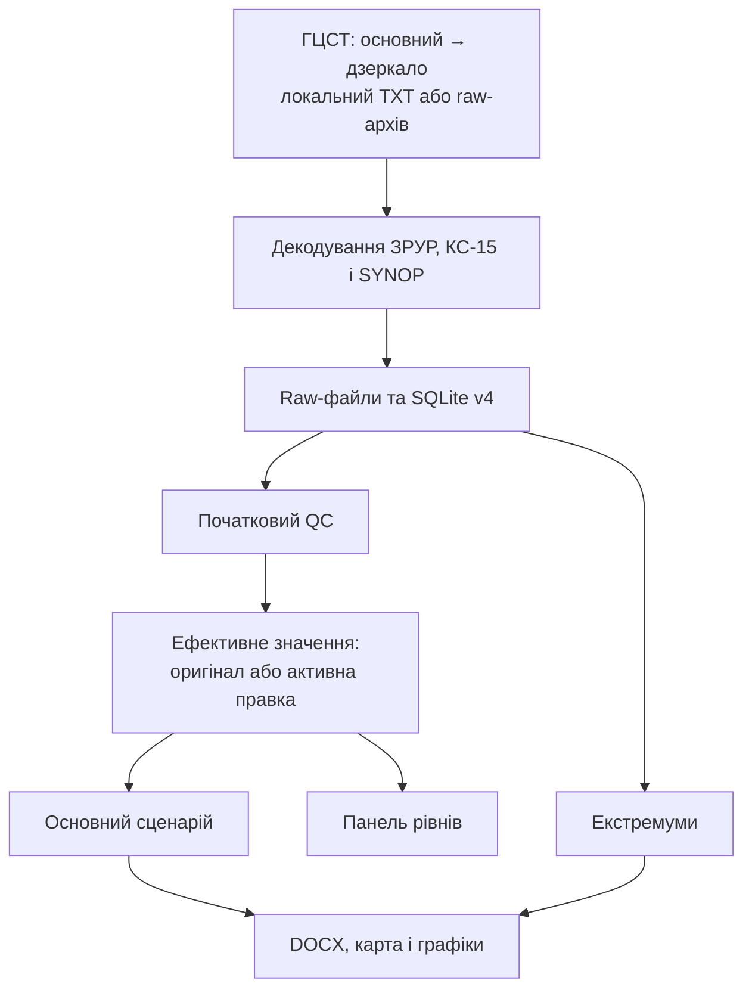

# Архітектура HydroBulletin

## Наскрізний сценарій



`workflow.py` координує послідовність операцій. CLI й GUI формують
`WorkflowRequest`; правила імпорту, QC та створення матеріалів залишаються у
профільних модулях. Повідомлення про перебіг виконання передаються до GUI
через функцію зворотного виклику без дублювання прикладної логіки.

## Відповідальність модулів

- `models.py` — агрегований запис поста та нормалізовані числові/текстові
  вимірювання.
- `stations.py` — 71 унікальний гідропост і 10 потрібних метеостанцій.
- `regions.py` — регіони, списки постів, шаблони й правила іменування DOCX.
- `sources.py` — локальне, онлайн- та архівне джерела, основний ГЦСТ,
  дзеркало, повторні спроби й тайм-аути.
- `decoder.py` — групи 0, 1, 2, 3, 4, 5, 7, 8 КС-15 та `NIL`.
- `meteorology.py` — SM/SI, група `6RRRtR`, індикатор `iR`, UTC ↔ локальний
  час і повна сума 09:00–09:00 без підміни недоступної частини нулем.
- `batch.py` — пошук і хронологічний імпорт підтримуваних TXT.
- `archive.py` — raw, SQLite v4, міграції, правки, екстремуми, запити та
  provenance.
- `quality.py` — консервативні автоматичні прапорці без зміни оригіналу.
- `levels.py` — оперативна вибірка для Панелі рівнів.
- `extremes.py` — одноразове перенесення довідкових рівнів із шаблонів.
- `bulletins.py` — параметризований генератор трьох Word-бюлетенів.
- `maps.py` — рівень, зміна й температура на офіційному PNG-шаблоні.
- `charts.py` — архівні графіки рівнів і витрат із пропусками та QC.
- `output_paths.py` — календарні папки результатів.
- `runtime.py` — окремі корені ресурсів і робочих даних Python/EXE.
- `workflow.py` — один сценарій імпорту, QC і генерації матеріалів.
- `gui.py` — форма запуску, Панель рівнів, Екстремуми та журнал виконання.
- `main.py` — CLI, пакетний запуск і запуск GUI.
- `launcher.py` — віконна точка входу зібраного Windows-застосунку.

## Онлайн-джерело ГЦСТ

Для онлайн-запиту доступні `auto`, `primary` і `mirror`. У режимі `auto`
кожен тип повідомлення спочатку завантажується з основного сервера. Якщо він
недоступний, повертає помилку або не містить придатних кодів за вибрану дату,
той самий запит виконується до дзеркала.

Резервний перехід реалізовано в модулі джерел. Декодер, raw-архів, SQLite та
генератори не залежать від адреси сервера. У `source_name` зберігається
фактична адреса, тому походження даних відтворюване. Після невдалих
онлайн-джерел загальний режим `auto` може використати наявний raw-архів.

## Модель SQLite v4

### `stations`, `imports` і raw-архів

`stations` є єдиним довідником пунктів. `imports` фіксує унікальну спробу
імпорту, шлях до незмінного raw-файлу, SHA-256 і кількість байтів.
`source_key` враховує тип джерела, повідомлення, дату та хеш, тому повторний
запуск не створює дубліката. Самі raw-файли зберігаються у календарній
структурі файлової системи, а не в окремій таблиці SQLite.

### `observations`

Один параметр одного поста в один момент часу:

```text
station_index + observed_at + parameter_code
+ value або text_value + unit
+ quality_status + quality_message
+ source_type + source_file + raw_record + import_id
```

Первинні `value` і `text_value` не редагуються. Унікальність
`station_index + observed_at + parameter_code` не дозволяє дублювати часовий
ряд. Текстове поле потрібне, зокрема, для льодових явищ групи 5; товщина льоду
з групи 7 зберігається числом у сантиметрах. Для опадів у `text_value`
додатково зберігається стан `MEASURED`, `NO_RAIN` або `TRACE`. У бюлетені
відсутність опадів позначається порожньою коміркою, а `0,0` виводиться лише
для слідів.

### `corrections`

Правка посилається на конкретне спостереження і містить нове значення,
причину, автора, час створення, стан та дані скасування. Частковий унікальний
індекс дозволяє не більше однієї активної правки на спостереження.

Редагувати можна лише `WATER_LEVEL` і `DAILY_CHANGE`; значення має бути
скінченним цілим числом у допустимому інтервалі. SQL-запити повертають
ефективне значення через правило:

```text
активна правка існує ? corrected_value : original_value
```

Тому панель, бюлетені, карта й графік рівнів не реалізують власних правил
підміни й завжди бачать однакові дані. Скасування повертає поточні продукти
до оригіналу, але не стирає запис журналу.

### `reference_extremes`

Для кожного поста зберігаються максимальний, середній і мінімальний
багаторічні рівні, необов'язкові дати екстремумів, джерело, автор і час
оновлення. Під час першого запуску відсутні рядки переносяться з колонок
офіційних Word-шаблонів. Подальші запуски не перезаписують введені вручну
значення.

### `products` і `product_observations`

`products` реєструє DOCX або PNG, тип, дату, шлях і метадані.
`product_observations` фіксує кожне використане спостереження та знімок
ефективного числового/текстового значення й `correction_id` у момент
створення продукту:

```text
DOCX або PNG → product_observations → observation → import → raw-файл
                         └──────────→ correction
```

Подальше скасування правки не переписує історію вже сформованого
продукту. Повторне формування того самого продукту оновлює його запис і
зв'язки, а не створює дублікати.

## Контроль якості

Автоматичні правила зберігають прапорець і пояснення, але не змінюють дані:

- `VALID` — значення пройшло початкові правила;
- `MISSING` — значення або обов'язкове поле відсутнє;
- `SUSPICIOUS` — потрібна увага;
- `OUT_OF_RANGE` — поза консервативним фізичним інтервалом;
- `INCONSISTENT_CHANGE` — кодована зміна не дорівнює різниці рівнів;
- `CORRECTED` — SQL-вибірка використала активну контрольовану правку.

Коди залишаються стабільними у SQLite та Python-логіці. У GUI, консольному
підсумку й розширеному Word-шаблоні користувач бачить українські назви:
«Без зауважень», «Дані відсутні», «Підозріле значення», «Поза діапазоном»,
«Неузгоджена зміна» та «Виправлено».

Від'ємні рівні допустимі. Товщина льоду перевіряється як числовий параметр,
а льодове явище — як текстовий. На графіках пропуски не стають штучними
нулями; точки із зауваженнями QC виділяються без зміни значень.

## Бюлетені, карта й графіки

`bulletins.py` читає з SQLite оперативні значення, льодові групи та
довідкові екстремуми. Стовпці багаторічного максимуму, середнього і мінімуму
заповнюються з `reference_extremes`, а використаний набір додається до
метаданих продукту.

`maps.py` читає ранковий рівень, добову зміну й температуру води. Значення
наносяться на фіксовані позиції шаблону 1920 × 1080; відсутні поля лишаються
порожніми. Для чіткого тексту рендеринг відбувається зі збільшенням у чотири
рази з подальшим антиаліасингом.

`charts.py` працює без дисплея через Matplotlib Agg. Рівні 08:00 і 20:00
утворюють одну хронологічну послідовність, витрата — один добовий ряд 08:00.
Суцільна синя лінія показує послідовні вимірювання, пунктир — внутрішній
пропуск. Назви PNG стабільні; період, пост, кількість значень, пропусків і
точок зі статусами QC реєструються у SQLite.

## Панель рівнів і Екстремуми

GUI відкриває обидва інструменти поверх тієї самої бази, яку використовує
`workflow.py`. Панель рівнів збирає ранок вибраної дати, вечір попередньої
доби, добову зміну, QC та ідентифікатори активних правок. Діалоги створення і
скасування перевіряють автора, причину та значення до запису транзакції.

Редактор екстремумів показує всі пости вибраних регіонів і додає або оновлює
один довідковий рядок (`upsert`). Перевірка не дозволяє порожнього автора,
нечислових рівнів або нелогічного порядку `максимум ≥ середнє ≥ мінімум`.

## Відтворюваність та міграція

`SCHEMA_VERSION = 4`. Відкриття бази v3 автоматично додає текстові значення,
таблиці правок/екстремумів і поля знімка provenance, не видаляючи імпорти,
спостереження чи продукти. Міграція і повторний запуск покриті тестами.

Календарний шлях має вигляд `Готові матеріали/РРРР/Назва місяця/`.
Бюлетені й карта належать місяцю дати матеріалів, графіки — місяцю кінцевої
дати періоду.

У PyInstaller-збірці незмінні шаблони, карта, шрифт і конфігурація читаються
з каталогу пакета. SQLite, raw-архів, `.env` і готові матеріали створюються
поруч із `HydroBulletin.exe`; це запобігає запису до тимчасового каталогу
розпакування. `.env` і робочі дані до дистрибутива не входять.
